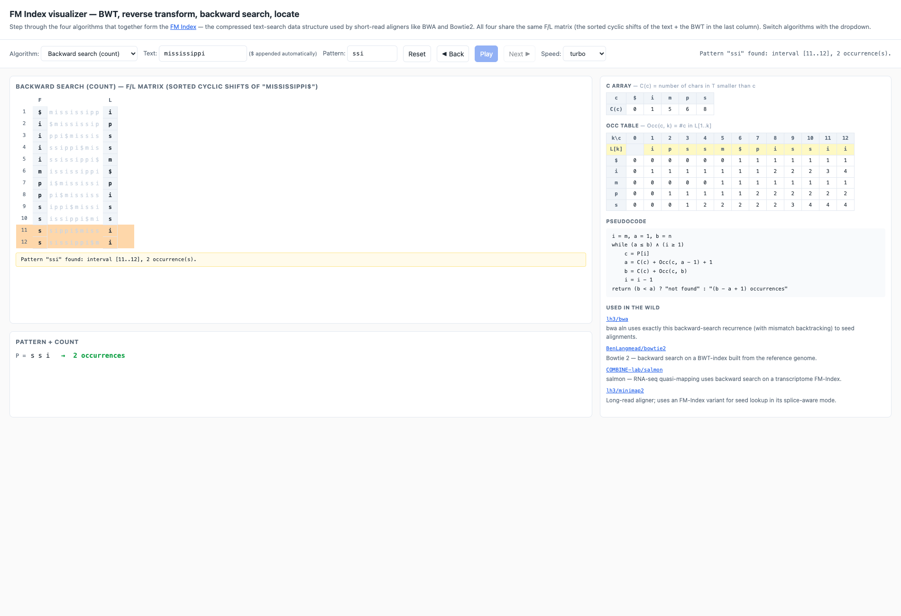

# algbio-edu — interactive visualizers for algorithmic bioinformatics

> **Want a new visualization?** [Open an issue](https://github.com/r-sayar/algbio-edu/issues/new) and describe the algorithm — contributions and requests are welcome.

Single-page web demos for the central algorithms taught in an
"Algorithmic Bioinformatics" course (FU Berlin ALBI, WS 2024 lectures
by Hölzer / Backofen / Liebl). Each demo follows the same pattern:

- a DP matrix (or trellis) heatmap that fills step-by-step,
- a **Reset / ◀ Back / Play / Next ▶** controller,
- keyboard shortcuts (← / → / space),
- an output panel showing what the algorithm decoded
  (alignment / state path / structure).

This is a sister repo to [**rna-folding-edu**](https://github.com/r-sayar/rna-folding-edu)
(Nussinov + Zuker for RNA secondary-structure prediction).

## What's here

| Folder | Algorithm | Demo |
|---|---|---|
| [`hmm/`](hmm/index.html)              | **Viterbi, Forward, Backward, Posterior** on a 2-state CpG-island HMM | [open](https://r-sayar.github.io/algbio-edu/hmm/) |
| [`alignment/`](alignment/index.html)  | Needleman-Wunsch (global) and Smith-Waterman (local) | [open](https://r-sayar.github.io/algbio-edu/alignment/) |
| [`fm-index/`](fm-index/index.html)    | **FM Index**: BWT construction, reverse transform, backward search, locate matches | [open](https://r-sayar.github.io/algbio-edu/fm-index/) |
| [`lander-waterman/`](lander-waterman/index.html) | **Lander–Waterman shotgun-sequencing statistics**: coverage, # contigs, contig length, gaps — Poisson simulation alongside the closed-form predictions | [open](https://r-sayar.github.io/algbio-edu/lander-waterman/) |
| [`poisson/`](poisson/index.html) | **Poisson distribution**: PMF, predictor, real-data overlay (Rutherford-Geiger 1910) and live simulation. Includes the DNA "reads-in-window" scenario. | [open](https://r-sayar.github.io/algbio-edu/poisson/) |
| [`binomial/`](binomial/index.html) | **Binomial distribution**: PMF + BINS assumptions, real-data overlay (Geissler 1889 sex ratios), Poisson(np) approximation toggle, live simulation. Same DNA "reads-in-window" scenario for direct comparison with Poisson. | [open](https://r-sayar.github.io/algbio-edu/binomial/) |
| [`gene-expression-norm/`](gene-expression-norm/index.html) | **RPKM/TPM + quantile normalization + MA plot** — three-in-one within/between-sample normalization visualizer. The quantile-norm walks the slide's 5×3 toy matrix step by step (Reset/Back/Play/Next). | [open](https://r-sayar.github.io/algbio-edu/gene-expression-norm/) |
| [`bh-procedure/`](bh-procedure/index.html) | **Benjamini-Hochberg FDR control**: sorted p-values with the `y = (i/N)·α` cutoff line, Bonferroni comparison, simulated truth panel showing empirical FDR for each correction. | [open](https://r-sayar.github.io/algbio-edu/bh-procedure/) |
| [`nb-model/`](nb-model/index.html) | **Negative binomial mean-variance** — the DESeq2 count-model diagnostic. Log-log mean-vs-variance scatter overlaying the Poisson line (slope 1) and `Var = μ + α·μ²` curves; μ and α sliders. | [open](https://r-sayar.github.io/algbio-edu/nb-model/) |
| [`pca/`](pca/index.html) | **Principal Component Analysis** — 4-stage walkthrough on a tilted 2D Gaussian (center → axes → rotate → project) plus a 50-D scree plot with automatic elbow detection. Analytical 2×2 + Jacobi eigendecomposition. | [open](https://r-sayar.github.io/algbio-edu/pca/) |
| [`tsne-umap/`](tsne-umap/index.html) | **t-SNE & UMAP kernel comparison**: Gaussian (high-D), Student-t (low-D), UMAP `1/(1+a·d^(2b))`, and k-NN Heaviside plotted on one axis — the "heavy tails" story made visual. Toy-cluster deformations under each kernel. | [open](https://r-sayar.github.io/algbio-edu/tsne-umap/) |
| [`knn-lda/`](knn-lda/index.html) | **k-NN vs LDA** side-by-side: k-NN decision-region heatmap + click-to-drop-query-point + line-to-neighbors; LDA linear boundary perpendicular to `w = Σ⁻¹(μ₁ − μ₀)` with the 1-D Fisher projection histogram. | [open](https://r-sayar.github.io/algbio-edu/knn-lda/) |
| [`roc-pr/`](roc-pr/index.html) | **ROC & Precision-Recall curves** with a draggable threshold τ driving three coupled panels (score histogram, ROC, PR). Imbalance presets (π₁ = 0.5 → 0.001) show why PR matters on rare-positive problems. | [open](https://r-sayar.github.io/algbio-edu/roc-pr/) |
| [`functional-enrichment/`](functional-enrichment/index.html) | **Gene Ontology over-representation analysis + GSEA**: interactive 2×2 contingency table, exact hypergeometric PMF with tail shading (Fisher's exact p-value), and GSEA random-walk enrichment score. Sliders for N/K/n/k; Enriched vs Null mode toggle. | [open](https://r-sayar.github.io/algbio-edu/functional-enrichment/) |
| [`blood-go/`](blood-go/index.html) | **Blood proteome GO enrichment**: real PeptideAtlas data — 4,570 detected blood proteins tested against all GO terms (BP / MF / CC). 1,461 significantly enriched terms, searchable and filterable. | [open](https://r-sayar.github.io/algbio-edu/blood-go/) |
| [`evoformer/`](evoformer/index.html)  | 3-D voxel walk through one Evoformer block (AlphaFold) | [open](https://r-sayar.github.io/algbio-edu/evoformer/) |
| [`structure-scores/`](structure-scores/index.html) | GDT-TS / TM-score / lDDT — sliders + intuition | [open](https://r-sayar.github.io/algbio-edu/structure-scores/) |
| [`phylo/`](phylo/)                    | Neighbor-Joining + UPGMA + Fitch + Sankoff (Python + step-by-step PNG figures) | [browse](phylo/) |

The eight `gene-expression-norm` / `bh-procedure` / `nb-model` / `pca` /
`tsne-umap` / `knn-lda` / `roc-pr` / `functional-enrichment` demos accompany the
*Gene Expression Analysis* lectures (Vingron / Jahn / Heinrich / Marsico, FU Berlin) —
see the companion text notes at
[r-sayar/albi_exams](https://github.com/r-sayar/albi_exams)
(`GeneExpression_DetailedNotes_BlocksI-III.md`,
`GeneExpression_DetailedNotes_BlocksIV-VII.md`, and
`GeneExpression_DetailedNotes_BlockVIII.md`).

For RNA structure (Nussinov + Zuker + 3D PDB):
**[r-sayar/rna-folding-edu](https://github.com/r-sayar/rna-folding-edu)** ([open](https://r-sayar.github.io/rna-folding-edu/visualizer/)).
For HMM training/evaluation on real DNA (the algorithm code that the
HMM viz here visualises):
**[r-sayar/cpg-island-hmm](https://github.com/r-sayar/cpg-island-hmm)**.

## Each demo, in one paragraph

### HMM inference — `hmm/`

A two-state Hidden Markov Model (B = background, I = CpG island) with
hand-tuned emission and transition probabilities, four algorithms
selectable from a single dropdown:

- **Viterbi** — max-product. The trellis fills column-by-column; each
  cell stores the max log-prob of any path ending in `(state, position)`
  plus a back-pointer. The traceback follows back-pointers from the
  final argmax to recover the single most-likely state path.
- **Forward** — sum-product (logsumexp). Same trellis shape but the
  recurrence sums over all paths instead of maxing over them. Output:
  `log P(x) = logsumexp_s f[s][n-1]`.
- **Backward** — sum-product, right-to-left. `b[s][i] = P(x_{i+1}..x_n | state_i = s)`.
  Independent recurrence, but should agree with Forward on `P(x)` — a
  built-in correctness check.
- **Posterior decoding** — runs both Forward and Backward, then
  `γ[s][i] = exp(f[s][i] + b[s][i] − log P(x))`. The decoded path is
  `argmax_s γ[s][i]` *at each position independently*. Three trellises
  are stacked: F, B, γ.

For the default preset `ATATATATCGCGCGCGATATATAT`:
- Viterbi → `BBBBBBBBIIIIIIIIBBBBBBBB`
- Forward → `log P(x) = −28.353`
- Backward → `log P(x) = −28.353` ✓ (matches Forward)
- Posterior → `BBBBBBBBIIIIIIIIBBBBBBBB` (here it agrees with Viterbi
  because the signal is strong; on borderline sequences they can differ)


### FM Index — `fm-index/`

Four algorithms that share the same sorted-cyclic-shifts (F/L) matrix:

1. **BWT construction** — show the cyclic shifts of `T = mississippi$` being
   added (unsorted pane), the sort, then the last column extracted row by row
   into the BWT string `ipssm$pissii`.
2. **Reverse transform** (BWT⁻¹) — walk the L-to-F mapping `LF(i) = C(L[i]) + Occ(L[i], i)`
   from row 1, extracting one character of the original text at each step
   until `mississippi$` is reconstructed.
3. **Backward search (count)** — Ferragina-Manzini's right-to-left pattern
   match. Maintains an interval `[a..b]` of matching rows; shrinks it by
   `a' = C(c) + Occ(c, a-1) + 1`, `b' = C(c) + Occ(c, b)` for each new
   pattern character. The default preset `P = ssi` ends with interval `[11..12]`
   → 2 occurrences.
4. **Locate matches** — given the search interval, walk LF from each row
   until you hit a *marked* row (a sampled SA entry) and read the position.
   Recovers the text positions (3 and 6) without storing the full suffix array.



The right sidebar always shows the **C array** and the **Occ table** with
the currently-consulted cells highlighted in orange. The active line of the
pseudocode lights up yellow. The bottom yellow strip spells out the
arithmetic for the current step.

### Lander–Waterman shotgun-sequencing statistics — `lander-waterman/`

Interactive Poisson model of whole-genome shotgun sequencing. Sliders set
coverage `a`, read length `L`, minimum overlap `θ = Ω/L`, and the "real"
genome size `G`. The top score row shows the closed-form theoretical
predictions side-by-side with the value measured from a single Poisson
simulation on a 5 000-bp cartoon genome (rescaled to keep the same `a`).

What's visualised:

1. **Genome cartoon** — 5 000 bp strip with reads drawn as colored bars,
   stacked greedily. Reads in the same contig share a colour; the
   rightmost read of each contig is outlined in yellow and labelled "H"
   (the *head* in Lander–Waterman's coin-flip argument). Covered regions
   are shaded blue, gaps red.
2. **Theory curves** — three side-by-side mini-plots of
   `% genome in contigs`, `# contigs`, and `mean contig length` vs.
   coverage `a`, with a blue dot marking the current operating point.
3. **Simulation report** — table comparing theory vs. measurement on the
   cartoon: `N` reads placed, fraction in contigs, # contigs, reads /
   contig, mean / longest contig length, # gaps, mean gap.
4. **Contig-length histogram** — empirical distribution from the
   simulation.
5. **Live arithmetic** — the LW formulas evaluated with your current
   slider values (`a = N·L/G`, `q = 1−e^{-a}`, `E[#c] = N·e^{-(1−θ)a}`,
   `E[reads/c] = e^{(1−θ)a}`, `E[len] = (e^a − 1)·L / a`).

Presets cover BAC 2× coverage, WGS 1× / 5×, E. coli 600× MiSeq, and the
canonical "Lander–Waterman 99 % coverage" point (`a = −ln(0.01) ≈ 4.6`).


### Pairwise alignment — `alignment/`

Side-by-side **Needleman-Wunsch** (global, end-to-end) and
**Smith-Waterman** (local, best subsegment). Same DP shape — only the
boundary conditions and traceback rules differ. Each cell shows its
score and a back-pointer (↖ / ↑ / ←); the chosen traceback path is
highlighted in green and the recovered alignment is rendered below
the matrix with match/mismatch colouring.


### Evoformer block — `evoformer/`

3-D voxel-grid walkthrough of one Evoformer block from AlphaFold 2.
Each cube is one tensor cell; hue runs blue (negative) → red (positive).
Use **prev / next / play** to step through MSA-row attention →
MSA-column attention → outer product mean → triangle attention →
triangle multiplication → transition.

This was already a self-contained tool in `albi_exams/evoformer_viz/web/`;
copied here unchanged for hosting.

### Protein structure-similarity scores — `structure-scores/`

Interactive playground for the four scores that compare predicted vs.
experimental protein structures: **GDT-TS**, **TM-score**, **GDT-HA**,
**lDDT**. Move the per-residue distance sliders, watch each score
update in real time, and read the short intuition panel.

Already self-contained at `albi_exams/structure_scores/`; copied here.

### Phylogenetics — `phylo/`

Python implementations of the lecture's distance-based
(`neighbor_joining.py`, `upgma.py`) and parsimony (`fitch.py`,
`sankoff.py`) tree-reconstruction algorithms, plus the rendered
step-by-step PNG figures. Run e.g.

```bash
cd phylo
python3 -c "from neighbor_joining import neighbor_joining; import numpy as np
D = np.array([[0,5,9,9,8],[5,0,10,10,9],[9,10,0,8,7],[9,10,8,0,3],[8,9,7,3,0]], float)
nwk, steps = neighbor_joining(['A','B','C','D','E'], D)
print(nwk)"
# → ((C:4,(A:2,B:3):3):1,(D:2,E:1):1);
```

Each step in `steps` carries the current distance matrix, Q matrix,
which two clusters were joined, the new branch lengths, and the
growing Newick string — perfect raw material for a future interactive
NJ visualizer (TODO).

## Controls (uniform across all interactive demos)

- **Reset** — rewind to before any step
- **◀ Back** — undo one step
- **Play** — toggle auto-advance (becomes Pause)
- **Next ▶** — advance one step
- **←** / **→** keys — back / forward
- **space** — toggle play/pause
- **Speed** dropdown — slow / medium / fast / turbo

URL parameters work the same way: `?seq=...&autoplay=1&speed=2`
(plus per-demo extras documented at the top of each `index.html`).

## Running locally

```bash
git clone https://github.com/r-sayar/algbio-edu.git
cd algbio-edu
python3 -m http.server 8765
# open http://localhost:8765
```

All demos are static HTML/CSS/JS — no build step. The `phylo/`
scripts need `numpy` (and `matplotlib` for the figures, which are
already pre-rendered as PNGs).

## Credits

- Algorithms follow the Hölzer / Backofen / Liebl WS 2024 ALBI
  lectures at FU Berlin.
- The "DP matrix + structure side by side" teaching layout is
  inspired by the Backofen Lab's
  [RNA-Playground](https://github.com/BackofenLab/RNA-Playground).
- All JavaScript here is original; the Evoformer and structure-scores
  pages were already self-contained tools in `albi_exams/` and are
  hosted unchanged.
