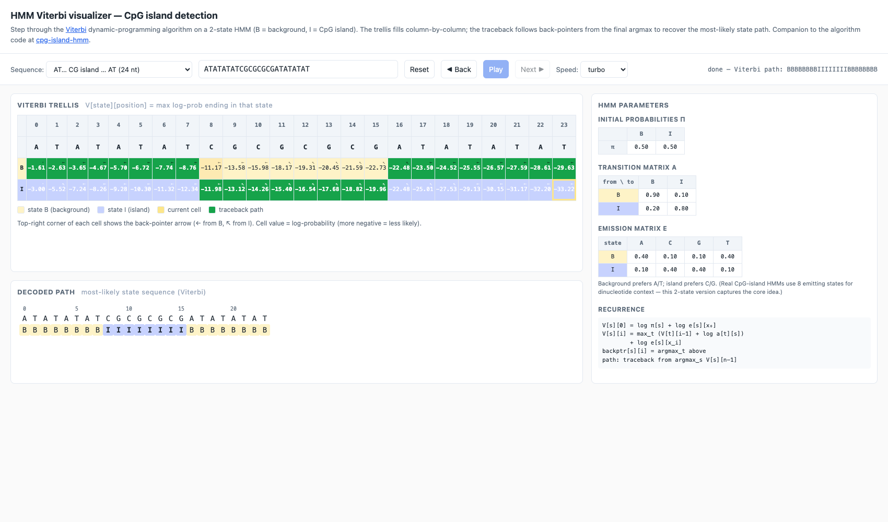
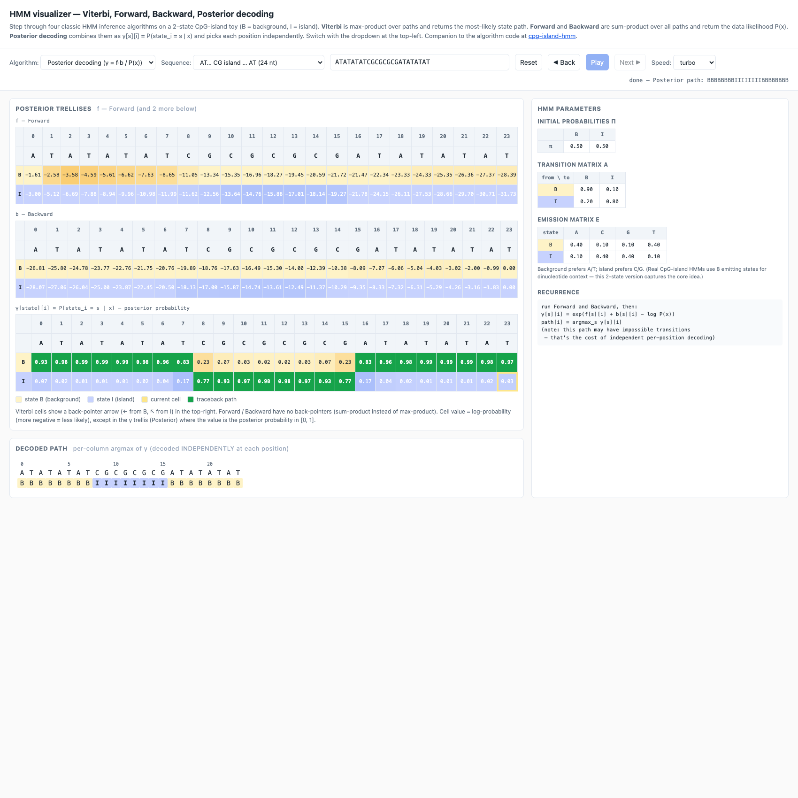
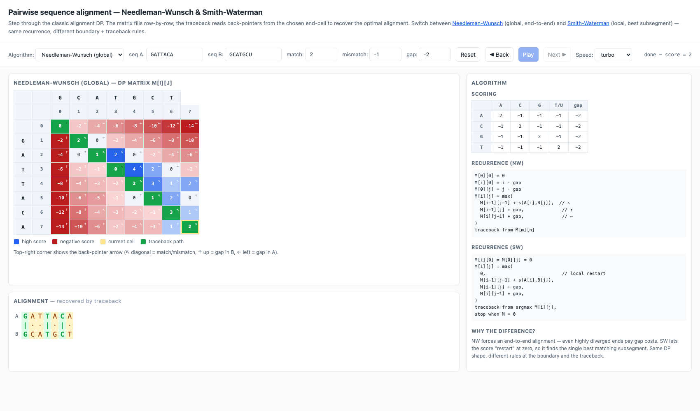

# algbio-edu — interactive visualizers for algorithmic bioinformatics

Single-page web demos for the central algorithms taught in an
"Algorithmic Bioinformatics" course (FU Berlin ALBI, WS 2024 lectures
by Hölzer / Backofen / Liebl). Each demo follows the same pattern:

- a DP matrix (or trellis) heatmap that fills step-by-step,
- a **Reset / ◀ Back / Play / Next ▶** controller,
- keyboard shortcuts (← / → / space),
- an output panel showing what the algorithm decoded
  (alignment / state path / structure).

This is a sister repo to [**rna-folding-edu**](https://github.com/r-sayar/rna-folding-edu)
(Nussinov + Zuker for RNA secondary-structure prediction).

## What's here

| Folder | Algorithm | Demo |
|---|---|---|
| [`hmm/`](hmm/index.html)              | **Viterbi, Forward, Backward, Posterior** on a 2-state CpG-island HMM | [open](https://r-sayar.github.io/algbio-edu/hmm/) |
| [`alignment/`](alignment/index.html)  | Needleman-Wunsch (global) and Smith-Waterman (local) | [open](https://r-sayar.github.io/algbio-edu/alignment/) |
| [`evoformer/`](evoformer/index.html)  | 3-D voxel walk through one Evoformer block (AlphaFold) | [open](https://r-sayar.github.io/algbio-edu/evoformer/) |
| [`structure-scores/`](structure-scores/index.html) | GDT-TS / TM-score / lDDT — sliders + intuition | [open](https://r-sayar.github.io/algbio-edu/structure-scores/) |
| [`phylo/`](phylo/)                    | Neighbor-Joining + UPGMA + Fitch + Sankoff (Python + step-by-step PNG figures) | [browse](phylo/) |

For RNA structure (Nussinov + Zuker + 3D PDB):
**[r-sayar/rna-folding-edu](https://github.com/r-sayar/rna-folding-edu)** ([open](https://r-sayar.github.io/rna-folding-edu/visualizer/)).
For HMM training/evaluation on real DNA (the algorithm code that the
HMM viz here visualises):
**[r-sayar/cpg-island-hmm](https://github.com/r-sayar/cpg-island-hmm)**.

## Each demo, in one paragraph

### HMM inference — `hmm/`

A two-state Hidden Markov Model (B = background, I = CpG island) with
hand-tuned emission and transition probabilities, four algorithms
selectable from a single dropdown:

- **Viterbi** — max-product. The trellis fills column-by-column; each
  cell stores the max log-prob of any path ending in `(state, position)`
  plus a back-pointer. The traceback follows back-pointers from the
  final argmax to recover the single most-likely state path.
- **Forward** — sum-product (logsumexp). Same trellis shape but the
  recurrence sums over all paths instead of maxing over them. Output:
  `log P(x) = logsumexp_s f[s][n-1]`.
- **Backward** — sum-product, right-to-left. `b[s][i] = P(x_{i+1}..x_n | state_i = s)`.
  Independent recurrence, but should agree with Forward on `P(x)` — a
  built-in correctness check.
- **Posterior decoding** — runs both Forward and Backward, then
  `γ[s][i] = exp(f[s][i] + b[s][i] − log P(x))`. The decoded path is
  `argmax_s γ[s][i]` *at each position independently*. Three trellises
  are stacked: F, B, γ.

For the default preset `ATATATATCGCGCGCGATATATAT`:
- Viterbi → `BBBBBBBBIIIIIIIIBBBBBBBB`
- Forward → `log P(x) = −28.353`
- Backward → `log P(x) = −28.353` ✓ (matches Forward)
- Posterior → `BBBBBBBBIIIIIIIIBBBBBBBB` (here it agrees with Viterbi
  because the signal is strong; on borderline sequences they can differ)




### Pairwise alignment — `alignment/`

Side-by-side **Needleman-Wunsch** (global, end-to-end) and
**Smith-Waterman** (local, best subsegment). Same DP shape — only the
boundary conditions and traceback rules differ. Each cell shows its
score and a back-pointer (↖ / ↑ / ←); the chosen traceback path is
highlighted in green and the recovered alignment is rendered below
the matrix with match/mismatch colouring.



### Evoformer block — `evoformer/`

3-D voxel-grid walkthrough of one Evoformer block from AlphaFold 2.
Each cube is one tensor cell; hue runs blue (negative) → red (positive).
Use **prev / next / play** to step through MSA-row attention →
MSA-column attention → outer product mean → triangle attention →
triangle multiplication → transition.

This was already a self-contained tool in `albi_exams/evoformer_viz/web/`;
copied here unchanged for hosting.

### Protein structure-similarity scores — `structure-scores/`

Interactive playground for the four scores that compare predicted vs.
experimental protein structures: **GDT-TS**, **TM-score**, **GDT-HA**,
**lDDT**. Move the per-residue distance sliders, watch each score
update in real time, and read the short intuition panel.

Already self-contained at `albi_exams/structure_scores/`; copied here.

### Phylogenetics — `phylo/`

Python implementations of the lecture's distance-based
(`neighbor_joining.py`, `upgma.py`) and parsimony (`fitch.py`,
`sankoff.py`) tree-reconstruction algorithms, plus the rendered
step-by-step PNG figures. Run e.g.

```bash
cd phylo
python3 -c "from neighbor_joining import neighbor_joining; import numpy as np
D = np.array([[0,5,9,9,8],[5,0,10,10,9],[9,10,0,8,7],[9,10,8,0,3],[8,9,7,3,0]], float)
nwk, steps = neighbor_joining(['A','B','C','D','E'], D)
print(nwk)"
# → ((C:4,(A:2,B:3):3):1,(D:2,E:1):1);
```

Each step in `steps` carries the current distance matrix, Q matrix,
which two clusters were joined, the new branch lengths, and the
growing Newick string — perfect raw material for a future interactive
NJ visualizer (TODO).

## Controls (uniform across all interactive demos)

- **Reset** — rewind to before any step
- **◀ Back** — undo one step
- **Play** — toggle auto-advance (becomes Pause)
- **Next ▶** — advance one step
- **←** / **→** keys — back / forward
- **space** — toggle play/pause
- **Speed** dropdown — slow / medium / fast / turbo

URL parameters work the same way: `?seq=...&autoplay=1&speed=2`
(plus per-demo extras documented at the top of each `index.html`).

## Running locally

```bash
git clone https://github.com/r-sayar/algbio-edu.git
cd algbio-edu
python3 -m http.server 8765
# open http://localhost:8765
```

All demos are static HTML/CSS/JS — no build step. The `phylo/`
scripts need `numpy` (and `matplotlib` for the figures, which are
already pre-rendered as PNGs).

## Credits

- Algorithms follow the Hölzer / Backofen / Liebl WS 2024 ALBI
  lectures at FU Berlin.
- The "DP matrix + structure side by side" teaching layout is
  inspired by the Backofen Lab's
  [RNA-Playground](https://github.com/BackofenLab/RNA-Playground).
- All JavaScript here is original; the Evoformer and structure-scores
  pages were already self-contained tools in `albi_exams/` and are
  hosted unchanged.
